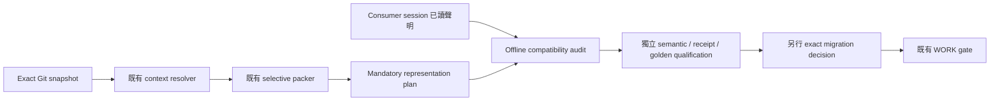

# R06 — 閱讀義務、聲明與 qualification route

狀態：CANDIDATE / NOT QUALIFIED。本設計承接原始需求 §26 progressive context、§48新功能Context Pack及既有PACKAGE_READING_OBLIGATIONS；不移轉 accepted re-entry、compiler 或 current intake owner。

## 問題與來源

既有resolver綁定full Git bytes，packer提供exact JSON去重／明示API closure／歷史suffix pointer。7477e51 snapshot的P01 selective277695 bytes、P02 selective373879 bytes仍超過131072 bytes；這是歷史量測，不是新版本byte宣告。P01r5/P02r2編譯與pack保留，不覆寫成READY。Current intake來源僅能確認execution/writer projection空，其他七分類UNKNOWN；本文件沒有positive-empty證據可消除它們。

`R06-SOURCE-01`（P1／REVIEW_AT_CHECKPOINT）記錄具體來源缺口：manifest top-level negative_assertions active binding不在原resolver mandatory清單。bound audit額外核對所有active bindings與negative_assertions，列出unrepresented exact refs／bytes；僅缺項不是NONE，不自行改resolver或降低byte gate。此為P00閱讀候選缺口，非產品runtime defect；也不把七份policy hash通過說成consumer已讀。

核心缺口是三個獨立問題：mandatory obligation是否完整、consumer是否保有exact閱讀內容、該內容是否來自當前合法authority。hash/source match只處理第三項的一部分；schema或caller已讀聲明不能證明前兩項。

## 單一 owner 與流程

新 `p00_reading.py` 是reading audit adapter，只讀選定Git snapshots，呼叫原resolver/packer。不建立registry writer、receipt store、controller或dispatch route。`context_reading_contract.v1.json`列出RQ01–RQ06；`reading_claim.schema.v1.json`閉合caller claim。操作輸出永遠execution_eligible=false、current_intake_complete=false。

## Representation obligation

每份mandatory document對應穩定`read:<repository path>`，並綁完整source commit/blob/SHA256/size及consumer。plan綁request（package、角色、changed paths、domains、planning SHA）、source/context/pack hash、工具/契約/schema來源；禁止跨snapshot拼接。mandatory少一份、多一份或重複一份均拒絕。

JSON payload hash針對expand_json完整還原的值（若有projection只還原該投影）；text hash針對UTF-8閱讀文字，原Git bytes hash另存且不受Windows CRLF影響。共享schema每個consumer document仍須理解其完整值，不因pool共用視為已讀。

`FULL_JSON_VALUE`／`FULL_TEXT`只證明內容被呈現；`JSON_PROJECTION`明示所有excluded endpoints/schemas，`CURRENT_SECTION_WITH_HISTORY_REFERENCE`保留archive hash及full-load trigger。每項semantic_discharge=NOT_REVIEWED，不能把有hash的exclusion說成完整閱讀義務已結案。未知相關性、scope擴張、cross-owner問題、歷史lineage或contradiction，回到完整exact source，不用新摘要覆寫原文。

## Reading claim 與 continuity

claim key是consumer（role/task/session/continuity epoch）、plan hash、obligation ID。同key同payload只算一次；同key不同payload是CONFLICT。舊plan、新consumer/task、來源／scope／pack變更、session或epoch變更均需重讀。continuity_epoch必須是真正正整數，不接受bool或1.0。

session ID只是caller標識，不能證明process或context仍存活。Context compaction、model/session切換或遺失原載入內容時必須由未來可信producer提升epoch；沒有producer attestation時audit仍是UNVERIFIED_CALLER_CLAIMS。即使每一份內容都被宣稱已讀，輸出也只到ALL_PAYLOADS_CLAIMED_NOT_VERIFIED，不能產生trusted acknowledgement、review PASS、intake receipt、acceptance或新grant。

本候選不把reading claim持久化。未來可信read acknowledgement由A2在exact successor authority下依CURRENT_INTAKE_REGISTRY_CONTRACT與producer trust契約接收；原item保持PRESENT。Registry/head或STOP變更撤銷行動proposal，不抹除歷史已讀記錄。沒有accepted bootstrap/current coverage時保留UNKNOWN，現有WORK re-entry不能省略。

## Alternatives / 建議

| 方案 | 所需證據 | 當前處置 |
|---|---|---|
| 單一lossless capsule，整體128KiB | 所有mandatory值可還原，總bytes含必要carrier metadata | 優先保留；目前未達標 |
| bounded semantic projection | stable obligation IDs、雙向引用closure、exclusion觸發、獨立source/projection比較 | 候選；不能僅因檔案大而省略prose |
| 分session載入與trusted receipts | exact continuity／handoff、producer trust、aggregate義務及遺漏oracle、明確successor budget語意 | 尚未授權；不能把原gate偷偷改成每批128KiB |

建議先完成source-to-obligation semantic mapping及代表性遺漏反例，保留原gate。若完整義務仍不能放進原target，提出一份具體successor decision供審查，不提高上限或將model token估計冒充bytes。工具另列representation bytes與plan metadata bytes供觀測；任何新數字都不能代替原始sum(source.size_bytes)。

## Qualification route / 風險

RQ01的offline結構驗證可在P00做；RQ02需獨立review每項原義務與API/security/state/scope exclusion；RQ03需可信receipt producer和accepted current registry bootstrap；RQ04需實際代表性任務／錯誤省略／context loss／head race golden evidence；RQ05維持original aggregate128KiB或另有exact reviewed successor；RQ06才允許精確compiler/resolver migration與完整authority/intake gates。合成negative fixtures不計實際golden成功。

必要反例：遺漏mandatory；偽造source ref；projection security/constraints消失；source變更後re-hash receipt；舊session重播；scope改變；consumer role改變；相同key相異payload；metadata自行加ACCEPTED；pack縮小但原bytes仍超限；STOP出現後沿用read claim；七分類UNKNOWN被改NONE。最後兩項仍由accepted WORK/current-intake owner判斷，本oracle不假裝已驗證registry race。

工具source match及plan hash能偵測混用，無法證明人類／模型真正理解來源；完整golden/independent review/原budget及current-intake仍是open gates。P00 closure0/8、release journeys0/6與127 provisional delta denominator保持不變。

## 使用方式與證據界線

CLI傳入exactrequest、consumer JSON、observed master SHA，選填claims JSON陣列；不傳claims會明列所有missing。observed master須由呼叫端fresh fetch取得，本工具只驗exact SHA與source baseline相同，不把它當network freshness attestation。新plan與bound loaded tool來源須在同個committed snapshot；未commit authoring delta不能偷偷當作source。

`python -B scripts/p00_reading.py --request <request.json> --consumer <consumer.json> --observed-master <40-char-SHA> [--claims <claims.json>]`

RQ01結構輸出可以保存為候選evidence，但不得生成「實際已讀」receipts。新設計pending focused independent review，無remote publishing、runtime／DB／broker side effects。
