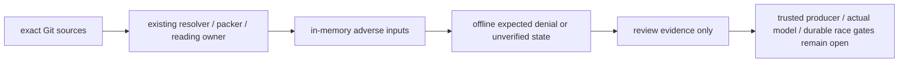

# R06 — repository-bound reading 規格評估

狀態：P00 CANDIDATE / OFFLINE SPEC ONLY。本 runner 復用 `p00_reading.py`、context resolver／packer，不成為第二個 reading、intake 或 authority owner。前輪 source map、CSV 提案、原始 reading contract／RQ01–RQ06 與 accepted sources 保持原樣。

## 問題與評估邊界

完整 payload claims、source hashes 與小型 representation 不能證明真正閱讀、public semantics、current intake 或執行權限。需要把已知反例在真實 P01/P02 source pack 上可重現地執行，並明列哪些類型仍沒有合格測試環境。

`p00_reading_eval.py` 讀取 exact planning Git snapshot；兩個 package 的原 exact_scope 供既有 resolver/packer 使用。新 runner 有獨立 tool snapshot，且 planning snapshot 必須是 tool snapshot 的 ancestor。既有 loaded owner bindings、七份 active policy raw hash 與 source refs 均保留。

Synthetic consumer 與 claims 僅是記憶體中的規格輸入；不保存成 durable receipt、不寫 current registry。輸出保存 case outcome、plan/pack hash、source refs、工具 binding 與明確未驗證欄位；不保存合成已讀收據。

## 正向、負面及 protected cases

每個 package 執行20個規格觀測；這不是20個 product／model golden PASS。

| 類型 | cases | 必須維持的結果 |
|---|---:|---|
| 無聲明、完整聲明、exact replay、少一項 | 4 | 缺項明列；完整聲明仍 UNVERIFIED；重複不新增覆蓋 |
| 同 key 異 payload 正／反順序、未知 obligation、payload 漂移 | 4 | 都拒絕；正反順序只是 sequential permutations，非併發證據 |
| task、session、continuity epoch、role 變更 | 4 | reread，不能沿用 predecessor claims |
| package scope、未重算 hash 的 plan 修改 | 2 | stale plan／integrity conflict，不猜 grant |
| 必讀 source 刪除、source 重複、pack/context 錯綁 | 3 | representation／context closure 拒絕 |
| claim 自增 execution authority | 1 | closed schema 拒絕 |
| manifest negative assertions 未 represented | 1 | source01 保留 OPEN；raw hash 正確不代表完整 mandatory |
| 原 aggregate budget | 1 | 131072-byte gate 維持，pack reduction 不清除原 source 超限 |

RQ02 仍未完成。額外 adverse test 刻意刪掉 TEXT 安全內容、保留 source ref 外形：pure `make_plan` 明確回傳 NOT_PERFORMED_PURE_FUNCTION／NOT_REVIEWED，不能拿這種 shape-only plan當source／語意 qualification。實際 source wrapper 重建及獨立 semantic review 仍必要；不把此輸入偽裝成真實 bound pack。

## 明確不能執行的評估

| 類型 | 尚缺來源／環境 | 不允許的推論 |
|---|---|---|
| Durable registry／STOP race | 可信 producer/current head 的 positive completeness、exact bootstrap及 migration authority | sequential array order 不等於 two-writer/concurrency proof；UNKNOWN 不變 NONE |
| 真實模型 context loss／reread | 實際 model/task fixture、可信閱讀 evidence、consumer trust／continuity protocol | synthetic session ID／epoch 不等於 process attestation |
| 完整 semantic omission | independent source-to-obligation review、projection exclusions及未分類 prose 的完整閱讀 | source roundtrip／完整 claims 不等於 semantics 完整 |

上述三類每個 package 各記 UNEXERCISED，不標 NOT_NEEDED、PASS 或 waived。CSV source02 的 A/B 選擇仍待決，不由評估 runner 決定格式。十三個 active denials、七個 invariants與full-source fallback仍為必要 review obligations。

## 替代方案、風險與建議

- E01：本輪採 repository-bound offline spec matrix，檢查既有 oracle fail-closed 行為。優點是可重現；限制是 synthetic claims、無 durable race／model trust。
- E02：取得 exact review／fixture／producer authority後執行真實模型 reading golden；需固定 task/model/context/continuity evidence，不能由 E01 分數替代。
- E03：取得 accepted current-registry successor／migration grant後執行 durable registry race與 STOP invalidation；既有 writer/intake/controller rules維持。

建議先審查 E01 的 pinned outcomes及缺口，再完成 E02/E03 所需契約與授權。RQ04 只增加離線 compatibility 證據，狀態仍 PARTIAL；不改原 RQ04 machine contract成 GOLDEN_QUALIFIED，也不讓作者自我驗收。

## 重現與 references

`python -B scripts/p00_reading_eval.py --planning-snapshot <完整輸入SHA> --observed-master <完整fresh master SHA> --tool-snapshot <含runner的完整SHA>`

輸出以 UTF-8 JSON保存於 `docs/program/reading_evaluations/`，exact source refs與工具 binding是追溯入口；report SHA256為移除自身report_sha256欄位後sorted compact UTF-8 JSON的hash。輸入 planning36f6c077…；reported source量測僅對這個 pinned snapshot，不冒充後續 HEAD 的量測。

References：`CONTEXT_READING_RECEIPTS.md`、`context_reading_contract.v1.json`、`SOURCE_READING_OBLIGATIONS.md`、`reading_claim.schema.v1.json`、`p00_reading.py`、既有 resolver/packer；source02 決策來源位於 `docs/program/decisions/`。所有驗證只在合法本機 P00 範圍，無 product authorization、acceptance、dispatch、merge、controller activation 或 publication。
