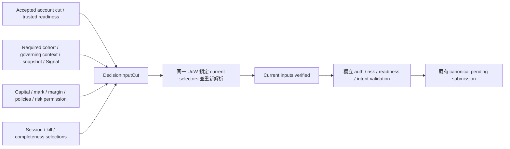

# Decision currentness / RecoveryCut 擴充契約 — P00 candidate

Status: `CANDIDATE_NOT_ACCEPTED`。本契約是 P05/P06/P08 的實作與審查輸入；沒有 runtime、migration 或交易授權。既有 GAP-08 RecoveryCut、account authority、trusted readiness 與 governing transition contracts 保持原有責任。

## 問題與選擇

Account revision 只見證經濟狀態。策略 snapshot、cohort policy、完整性證據、mark、margin、capital projection、RiskDecision 或 kill/session state 可以在 account revision 不變時改變。只重驗 account revision 或沿用舊 ALLOW 會漏掉這些變動。

選擇在既有 account recovery evidence 外組成 **DecisionInputCut**，以各 owner 的 exact immutable references 與 current selection 見證完整閉包。重寫 accepted RecoveryCut 會破壞既有 acceptance；單靠 timestamp、全域 strategy watermark 或泛用 event-store head 不能證明來源閉包。新增 cut 不取代 account RecoveryCut，也不把歷史 Decision/RiskDecision 本身變成 account readiness authority。

## Exact witness 與責任

Standalone schema `contracts/decision_input_cut.schema.v1.json` 定義內部 witness；不新增 HTTP endpoint、不修改 P01/P02 wire contracts。`account` 是既有 BrokerAccount 的 broker/account_ref，不能直接把 UI account_id 當成 canonical scope。`session_id`、cohort_id、instrument_id、contract_id 分別解析，不能用字串 alias。

`base_account_cut` 綁完整 RecoveryCut.witness_fingerprint 與 trusted account readiness bundle；account_revision、recovery_generation、ingress_version、readiness_revision 都須同世界，VALID/READY 的歷史結果不是 current permission。Recovery active/inactive 狀態亦屬 witness，不能用 active recovery fence 的缺席推導正常交易可用。

Accepted PostgresExecutionStateLoader／PostgresTrustedReadinessEvidenceResolver 目前要求 active recovery control；inactive 情境不能假稱可直接呼叫這兩者成功。P08 必須提供明確 read-only composition port，從 current account head/checkpoint/receipt、retained accepted handoff closure 與最新 owning witnesses 解析正常執行的 base evidence，並驗證 retained bundle 所選經濟／provider evidence 是否仍適用；任何變動須重新取得適用 readiness，不能以最後一次 READY 代替。此新增 adapter 的 inactive-source conformance 是 P08 的 explicit gate，現尚未實作。

`dependencies` 是 sorted、unique (kind,key) 的完整集合，每項含 selector_revision、exact record_id、schema_version、payload_hash。required membership 的 manifest 必由 accepted DecisionPolicyAuthorityProvider 解析；caller 不能縮減列表。manifest 綁 schema/profile、account/session/cohort/contract 與完整 expected (kind,key) 集合。缺失、額外、UNKNOWN、不同 scope 或來源無法解析均拒絕；零個 required strategy 不得默認為可交易。schema 通過不表示 producer coverage 已受信任。

| Kind | Current owner / witness | 同 account revision 的 invalidation |
|---|---|---|
| COHORT_POLICY | exact policy + required membership fingerprint | membership/policy 選擇改變；不能由 runtime presence 補成員 |
| STRATEGY_CONTEXT | 每個 required instance 的 instance/config/implementation/instrument binding、current transition resolution | PRE/IN_PROGRESS/POST 或 governing context 改變 |
| STRATEGY_OUTPUT | 每個 required instance 的 accepted snapshot + qualification + Signal + durable delivery/output receipt 閉包 | snapshot、codec、history/frontier 或 signal selection 改變；HOLD 成員仍必需 |
| COMPLETENESS | 每個 required instance 的 applicable completeness/K520 authority、receipt 與 exact observation frontier | receipt 被取代/失效、history correction；NOT_APPLICABLE 須正向 authority，不能省略 |
| OBSERVATION | accepted mor1 revision、listed contract/calendar/mapping binding | observation selection/revision 或 reference version 改變 |
| CAPITAL | immutable CapitalState + account checkpoint、mark、calculation/margin policy | capital current selector 或任一來源改變；不存在就是未知 |
| MARK | exact accepted mark revision / provenance | mark 更新，不用 timestamp 比大小 |
| MARGIN | versioned reference / constraint material | margin policy/reference 更新，不 fallback 0 |
| RISK_POLICY | exact constraints/reduction/rounding policy | policy 更換，舊 ALLOW 不再適用 |
| SESSION_CONTROL | session state、kill state、seed/scenario/clock checkpoint 與其 CAS revision | pause/stop/kill/recovery 改變；不能因 head 不變忽略內容變更 |

Decision + RiskDecision 是新 immutable records，最終使用 additionally 綁定 intent 的 exact decision/risk/trigger IDs、payload hashes 與各自 input-cut fingerprint。RiskDecision 必須引用同一 Decision/account/contract/cohort 和 capital revision；拒絕 outcome 不產生 intent。它們的歷史 append 不必令所有 account readiness 失效；只有選用的 current input、permission revocation 或上述 owner selection 變化才失效。Signal/qualification/CapitalState 的歷史 append 亦遵守此區別。

避免循環 identity：DecisionInputCut 僅描述計算輸入，不包含由該 cut 新產生的 Decision/RiskDecision。Standalone schema 的 `$defs/FinalSubmissionWitness` 再加入 exact decision/risk/trigger references 與 G-owned permission selection/revocation revision、receipt hash、decision/risk IDs、GRANTED/REVOKED disposition；新 permission grant/revoke 必須遵守同一 account decision fence。permission selection 由 G-owned append-only grant/revoke receipt 與 current CAS selector 解析；caller 的 disposition 不是 authority。最終消費者鎖定並重讀此 witness，歷史 ALLOW 的 payload hash 相同也不能繞過 revocation。這是後續 P06/P08 typed final-submission contract；本輪 fixture 未實作 permission resolver，不宣稱涵蓋其 runtime conformance。

## 儲存、原子性與 final fence

P05/P06 可以先完成純計算／offline conformance；P08 才整合 durable trading path，未完成前不得使用 memory-only selector 宣稱 recovery/dispatch 就緒。K 提供 typed repositories 與 caller-owned PostgreSQL UoW，E/G 擁有 payload semantics。新增 stores 與索引只能用新 migration；既有帳戶、OMS、snapshot 與 reconciliation stores 不搬家。

候選新增 `trading.decision_input_heads` 只保存 account-scoped currentness revision 與完整 current selection manifest 的 pointer/hash，不保存餘額、position 或 account economic revision。它是非經濟 currentness fence，revision 從 1 起且永久保留，recovery handoff 不刪除。建立時須有 explicit bootstrap receipt 與完整來源解析；缺 head 拒絕，不能按讀取結果自動建立。

所有影響此 account/cohort current selection 的 writer 必須在同一 UoW 先鎖 account_state_head，再鎖 decision_input_head，再鎖 recovery control（若存在），最後依 canonical (kind,key) 順序鎖 owner selector。依既有 accepted writer 的既定鎖序調整受影響 adapter；若實作證據顯示鎖序矛盾，PACKAGE_NOT_READY，不能自行改 accepted public semantics。多 account 共用 immutable policy 可以 append 後逐 account activate；未 activate 的資料不是該 account 的 current policy。不得使用跨 account 全域 watermark。

Writer 在持鎖下 append 新 evidence、CAS owner selector、advance decision_input_head 並 append currentness receipt，一次 commit；exact duplicate retry 回原 receipt，不額外 advance。既有 recovery active 時，影響 account recovery readiness 的變化另依 accepted RecoveryReadinessFenceRepository 協定 advance readiness_revision；此協定僅對 active recovery 有效，不能代替 permanent decision fence。

Final submit 在同一 caller-owned UoW 依相同鎖序解析所有 current owner selections、payload/material hashes、references 與 required membership，重建 cut 並逐項比較，不接受 caller 提供的 READY/manifest。重驗通過後仍要獨立通過 auth、account/strategy/cohort readiness、適用 risk、PositionEffect 與 EXIT→FLAT→重新決策規則，才可透過既有 DurablePendingSubmissionService／AccountAuthorityCommit 相關 port 保存 intent/pending attempt。不得在持有 DB transaction 時做 feature 計算或 broker I/O。

原子 fence 只涵蓋遵守協定的 writers；部署前必須檢查全部 current-selector producer。若存有繞過 shared lock/head 的路徑，拒絕整合。accepted AccountReadinessGate 或 trusted finalizer 單獨成功不足以證明新增 decision dependencies current。不能讓舊 API path 靜默繞過 composite gate。

## 失敗、復原與 acceptance

Identity/material contradiction、schema/codec mismatch、跨 account 混用：HALT/reject affected evaluation。Missing/unqualified source：REVIEW/BLOCKED。Currentness/CAS mismatch：discard proposal，重新解析、重新 Decision/Risk，不 silent retry 舊 permission。Crash before commit 全部回滾；response loss after commit 讀原 receipt。Resume 先復原 accepted account cut，再解析各 strategy/cohort/new-record 閉包；currentness 成功只回報 CURRENT_INPUTS，永不直接回 READY 或授權。

P08 必須以實際 disposable PostgreSQL、兩條連線與 crash/restart 驗證：同 account revision 的每類 dependency mutation、ABA selection、缺失 head/bootstrap、不同 membership manifest、stale final submit、hold-and-update blocking、rollback/no partial selector advance、response-loss duplicate、active/inactive recovery，以及共享 policy 的 account activation isolation。Static/fake SQL 和本候選 pure oracle 不能替代這些結果。

候選 fixture 的每類 mutation、missing/extra dependency、payload mismatch、scope mismatch、unsafe NONE 與 unchanged cut 用於審查反例；它只證明比較契約，不證明 DB durability、trusted producer coverage、semantic READY 或正式 acceptance。獨立 reviewer 須檢查 lock protocol 與 accepted writer 相容性後才能 freeze P08 package。

Sources: `persistence/recovery.py`、`persistence/postgres/recovery.py`、`persistence/readiness_fence.py`、`persistence/postgres/readiness_fence.py`、`persistence/strategy_recovery.py`、`persistence/postgres/strategy_recovery.py`、`persistence/postgres/uow.py`。Exact master Git blob bindings 位於 `contracts/dto_store_map.v1.json`。
