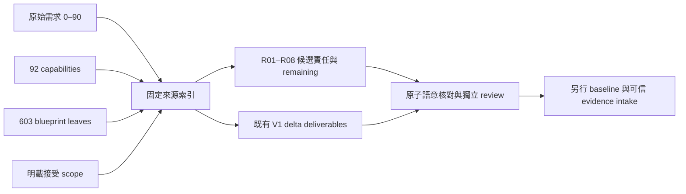

# R05 歷史需求來源索引

狀態：`CANDIDATE_SOURCE_INDEX_NOT_ACCEPTANCE`。本索引將既有來源接到候選設計／整合 delta，不改寫 authoritative 文件，不授權施工或自行接受。

`historical_requirements.v1.json` 固定原始 owner request 的 candidate snapshot `ca3e474687db3f484252d74a239ccc83d644658e`，其餘歷史來源固定 master `9b5ab5fdd98744a7db45ec9f14b64ef1f324920f`。每個檔案有 exact Git blob、SHA256；需求區段／文字區塊／表格列有原始 bytes 的列號與 hash。CRLF worktree 不能代替 Git blob。來源 universe 明列22檔：owner request、ARCHITECTURE、ROADMAP、V1_SYSTEM_BLUEPRINT、V1_CAPABILITY_MAP、TRACEABILITY、METRICS 與 A–O 十五份施工圖。既有 progress／accepted-core index 另綁 candidate blob，沒有新增第二套進度 owner。

## 不同數字的範圍

| 來源／scope | 核對結果 | 可以／不能推論 |
|---|---|---|
| 原始需求 | 91 sections、922非空連續文字區塊，preamble 與完整 section bytes 另保留 | 區塊包括標題、清單、程式框及說明；不是922個已驗收原子需求 |
| 七組明列義務 | 143個 clause IDs：32必交付、10非目標、6旅程、22 Skill評估、9 golden task類型、45交付項目、19輸出責任 | 每項有義務種類、候選 evidence／remaining；不是143項完成或新增分母 |
| Capability map | 92列，COMPLETE／PARTIAL／NOT_STARTED 原樣保留 | 歷史 capability 狀態不等於新產品 maturity 或整合完成 |
| A–O engineering tables | 603 leaves、2137歷史權重，全部 Maps 可追到92 capabilities | D01-D05／I01-I04 等範圍展開；多個 consumer 不重複領取 leaf weight |
| 歷史 ACCEPTED labels | 269 leaves、852權重，與原 METRICS 一致 | 保留來源宣告；沒有為每列補造同世界 acceptance intake |
| TRACEABILITY 六次明載接受紀錄 | 76 unique leaves、323原權重 | 只保留其 exact scope／accepted commit ancestor；不是完整歷史驗收清單 |
| GAP08 corrected core | 既有 index 的26 leaves／113權重 | 獨立 correction scope，不加到603／2137；不取代原35／151未接受 candidate |
| 新 V1 integration ledger | 原127 provisional delta weight 不變 | 本次新增 credit=0；產品完成率保持 UNCALIBRATED |

六次接受紀錄為 GAP-ACCOUNT-001、GAP-BROKER-001、GAP-RECON-001A／B、GAP-BROKER-002、GAP-08ABCD。前五項明載 PASS；ABCD 明載 accepted leaves／weight，但該區段没有單獨 PASS field，因此索引標示 `ACCEPTED_SCOPE_LIST_NO_PASS_FIELD`，不補寫 disposition。既有 GAP08 final／P7／isolated W4R PG 接受仍由 `accepted_core_reconciliation.v1.json` 綁定其原始範圍。

## 語意與候選 route

每個 OWNER-000～OWNER-090 都有 R01–R08 責任、已存在候選文件 pointer、具體 remaining；每個 capability 有全部 blueprint consumer、既有 delta deliverable links 與未交付邊界。這些 links 是候選架構判斷，checker 驗證來源、集合、引用與零 credit，不能證明語意正確或需求已交付。

143項明列 clause 另有細部 routes。V1非目標不自動承諾後續版本必須實作；22項 Skill 清單要求評估 reuse/gap，不要求建立22個新 Skill。既有七項 shadow Skill 只能作組合候選，不能被提升為已資格化能力。原六旅程依語意對應 candidate J2/J3/J4/J5/J6/J1，而非直接沿用原清單序號；每條仍需獨立核對完整邊界。

45項 required deliverables 中，以下10項目前保守列為 `NOT_YET_VERIFIED`，沒有以 generic registry／unit PASS 補造完整證據：Template strategy、Generator strategy、Pattern library strategy、Evaluation framework、Golden-task framework、AI development KPIs、Optimization loop、Token/time telemetry、Skill/Agent telemetry、AI-development-platform roadmap。其餘35項只列部分候選；不是35/45完成率。各 clause 的 source／workstream／remaining 可直接供下一次 authoring 與 review 使用。

特別保留三項需要明確 successor 審查的差異：

- 舊 ARCHITECTURE／ROADMAP 的 broker／live release 條件，與 owner request 第2／8節的 credentialless BACKTEST／SIMULATED V1 範圍不同。I Domain 既有 adapter／capability 契約保留，真券商驗證另列；原需求没有消失。
- 舊 V1_SYSTEM_BLUEPRINT 將 Y Deployment 留給 Post-V1；owner 第20節已要求 install／backup／restore 等在 V1 交付，候選由 P11 承擔。不得沿用舊分類而漏項。
- ROADMAP 的 GAP08 HOLD／READY、47.92% 及 Blueprint 的 provisional lifecycle 是有時間範圍的記錄。已接受 CURRENT／closure 為 current authority；不能由舊列恢復 runtime grant，也不能因此降級整份 ARCHITECTURE／ROADMAP 的權威性。

本次只聲稱 `COMPLETE_FOR_DECLARED_22_FILE_UNIVERSE` 的來源 inventory。完整歷史語意仍為 `INCOMPLETE_PENDING_ATOMIC_REVIEW`：22檔外的早期 request／ADR／GAP／其他 milestone 的全部 requirement 与 acceptance coverage 尚未取得閉合證明。source outlines 保留各節導航；不聲稱其所有內文條款皆已逐條 disposition。91 section routes 的存在也不能將 `request_coverage` 全部標成已完成。

## 重現與下一步

執行 `python -B scripts/p00_requirements.py` 可從固定 Git blobs 重建、核對索引；沒有網路、DB、寫檔、dispatch 或 acceptance side effect。負例涵蓋缺 section／區塊／capability／leaf、錯 source hash／列號、範圍漏 consumer、改權重／promote lifecycle、偽造 PASS、加入接受欄位、GAP08 重複計入與 altered worktree ledger。

下一步補齊10項缺交付／證據、未拆解 prose clauses、future scope 與22檔外其他歷史接受來源；對未取得範圍／producer closure 的項目保留 UNKNOWN。完成獨立 baseline weight review、可信 progress intake／invalidation 與實測 throughput／ETA 前，R05不能結案。新 registry 約1.13MB，作選擇性追溯索引，不加入 P01／P02 必讀 pack、不改128KiB gate、不重發歷史 compiled artifacts。
