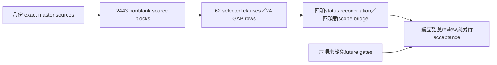

# R05 Historical Semantic Bridge — P00 Candidate

Status：CANDIDATE_AUTHORED_NOT_ACCEPTED；author/source check不提供current authority、independent acceptance或runtime conformance。

## Summary／問題與假設

既有primary index已完整保留22份指定來源、91 owner sections／143明列clauses、603歷史engineering leaves；沒有證明全部prose與其他歷史來源都已語意核對。本補件固定master `9b5ab5fdd98744a7db45ec9f14b64ef1f324920f`與candidate input `dce1e5409314539ca2ac98ba26ea54e8e6b1ab80`，只擴充八份明列master來源的有界source／proposal bridge，不改寫primary index或127 provisional delta ledger。

Machine owner：`historical_semantic_bridge.v1.json`；readonly checker：`scripts/p00_historical_semantics.py`。所有source以exact Git blob bytes、full-file refs、原line range與SHA256綁定，CRLF不先normalize。

這些數字是source/proposal集合大小；不是atomic requirements總數、完成比例、accepted invocation或新增V1權重。完整非空bytes indexing不等於全部語意accepted。

## Analysis／authority與source角色

| Source | 本次用途 | 不能推論 |
|---|---|---|
| ADR-001 | 已接受ownership/dependency/migration約束；explicit intent、manual capital、compatibility、跨語言owner | namespace target不要求mass move；舊finding不是此刻defect或新授權 |
| ADR-002 | 選定後續R01–R14決策：完整cut、instance/cohort、provenance、clock、Run、authority、coverage | 開頭checkpoint4 HOLD不代表corrected core仍未接受；原35/151也不被追認 |
| GAP Register | 三個table的24筆source rows與部分phase projection | GAP不是完整roadmap；CLOSED/source priority不等於V1整合或可執行authority |
| Backtest/Data補充文件 | next-bar/cost/reset/sizing、analytical stores、calendar/identity/quality責任 | current limitations與舊metric deferral不能單獨決定新V1 status |
| GAP08 freeze／final closure | planning／deferred boundary與scope接受的後續證據 | corrected113/113不涵蓋production、P8、V07、browser、new jobs/adapters |
| CURRENT_STATE | 固定snapshot的canonical operational current observation | P00 human design grant不授權003、runtime或controller |

每個selected span可能同時含舊status與契約；disposition只分類明列candidate interpretation，不將整段每一行自動升為current/inherited authority。

Original CURRENT/AGENTS/ADR/architecture/roadmap與所有accepted source均保持原bytes。先確認canonical CURRENT與exact later closure，再記錄source-only interpretation；本文件不建立第二個current writer。

## Status reconciliation／已核對的歷史差異

| ID | 歷史敘述 | 選定後續證據／保留限制 |
|---|---|---|
| H01 | ADR-002 checkpoint4 HOLD／35 leaves151 | GAP08 final corrected core113/113與accepted runtime head；original candidate仍NOT_ACCEPTED |
| H02 | GAP detail98/113、C17/C19/C20/C18 pending | Final closure五葉frozen/consumed；舊detail保留為phase資料，不重開已接受工作 |
| H03 | Correction freeze planning HOLD | 後續ACCEPTED_FOR_GAP08_SCOPE；runtime conformance/production仍NOT_ASSERTED |
| H04 | ADR-001 ENTRY-prefix finding | GAP-BROKER-001 source CLOSED；只承認原接受scope，不宣稱本輪fresh broker qualification |

H01/H02/H03是status年代差異，不是重新設計recovery。H04是bounded source declaration，未在本輪重跑broker。GAP-DOC-001仍source PARTIAL；本次只在P00記錄已定位的文件差異，未修補accepted/historical原文。

## Scope bridges／候選新義務

1. S01：舊Return／Sharpe post-P12延後，與新V1固定net return/daily return/Sharpe/null+reason不同。新metrics歸P04-ENGINE；沒有回填產品實作或接受。
2. S02：舊correction排除API/web/backup，與新V1 P02-BFF、P11-BACKUP-RESTORE是不同scope。新交付保留，不擴張舊GAP08接受或新增權重。
3. S03：ADR deferred production server與本機clean-machine V1部署分開。P11-INSTALL需要實際install/config/migration/restore gate；production activation不由此取得。
4. S04：credentialless BACKTEST／SIMULATED release不要求真broker credentials/P8證據，但未來broker/production path仍須相應capability/authority；fixture不能代替broker qualification。

每bridge綁唯一candidate原文line、full-file ref、existing delta IDs及independent-review pending status。Public semantics仍由Architect／原contract owners提供，不因source一致就qualified。

## Alternatives／選擇與remaining

| 方法 | 評估 |
|---|---|
| 重寫舊ADR／GAP status | 破壞歷史phase與accepted blob；本次不採用 |
| 把歷史權重加到新V1 denominator | scope重複且沒有可信intake；本次不採用 |
| 固定source／proposal bridge，保留不可推論事項 | 本次候選選擇；可供窄scope review與bounded follow-up |
| 宣稱八份來源代表全部歷史 | 不成立；outside-universe仍UNKNOWN，不能fake complete |

八份來源完整保留2443非空連續blocks；62條selected clause與其source line集合未涵蓋2803非空行。Unselected含heading/歷史phase/診斷等內容，不能當2803個新增requirements；需先有界分類，再決定是否需atomic obligation。其他authority指定文件、older handoffs、accepted artifact receipt/world與source-universe完整性尚未exhaustively closed。不能因本輪bridge通過就要求重做已完成R01、P01/P02或source index。

## Risks／未豁免gate

- P8 broker verification、original P9/V07 actual PG conformance、production N/L authority、approved operational completeness、LIVE／production activation及expanded product scope分開保留；沒有本輪verification/authority。
- R13 deferred full auth不取消core enforcement/default-deny；credentialless V1本身的application permissions仍P03/P09義務。
- R14 deferred full detector不取消positive scope/currentness proof；P01 quality或fake provider不能自證production completeness。
- Original V07未驗證不取消新P05/P08的實際PG/concurrency/crash acceptance；既有isolated W4證據只涵蓋原接受scope。
- Existing128KiB gate、complete pending-category intake、trusted progress/telemetry、actual golden、independent final review仍未完成。舊forecast/accepted labels/test counts不變成同世界production evidence。

## Recommendation／下一步與References

先由exact subject的focused reviewer檢查selected source interpretations／status supersession／scope bridge及future non-waiver；作者checker只檢查typed reconstruction、source/line/hash/omission/unknown boundary，不能判定語意正確。P00保持0/8 closed、7 partial，V1 completion UNCALIBRATED。

下一步處理R06 source/read closure與原context budget的候選驗收路徑，並保存R05 unselected/outside-universe backlog；不得放寬compiler gate以取得READY。Primary22-source index、26/113 accepted-core index、127 provisional delta ledger及previous focused-review subjects不變。最終R08 A–S與獨立baseline acceptance尚未完成。

References：machine registry內八份exact master full-file/block/span refs、candidate design refs與primary/ledger predecessor refs；`docs/CURRENT_STATE.md`仍canonical current，`docs/work/P00_BASELINE.md`仍此輪scope／授權guard。
