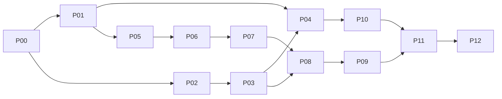

# V1 Program — P00 candidate

Status: `DESIGN_IN_PROGRESS / NOT_EXECUTION_AUTHORITY`。本文件定義候選工程分組；沒有 exact file scope、contract/schema 與驗收 evidence 的 package 不得標 READY。

## Outcome 與依賴

V1 是單人、本機部署的 Personal Futures Research & Simulation Workstation。BACKTEST / SIMULATED 可用；broker credentials、broker paper、LIVE 不屬於其 release gate。保留 broker abstraction，不以 mock 證明 broker conformance。

| ID | Cohesive outcome / contracts | Depends | Acceptance / required tests | Review / risk / effort estimate |
|---|---|---|---|---|
| P00 | Architecture, ownership, machine contracts, package compiler baseline | none | All request requirements traced; schemas/negative fixtures; independent semantic review | Architect; high semantic risk; remaining estimate pending completeness review |
| P01 | Versioned reproducible dataset + calendar/contract quality boundary | P00 | Import duplicate/conflict/holiday/night-session fixtures; immutable manifest; repeat hash; missing coverage rejected | Domain review; 6–9 effective days |
| P02 | Python API → ASP.NET BFF → React vertical slice | P00 | Local login; submit fixture research job; poll progress; inspect result/error; no browser direct DB/Python access | API/security review; 5–8 days |
| P03 | PG durable research jobs, worker lease, artifact publication + application-owned identity/session stores | P02 | Crash/reclaim/stale worker/cancel race/idempotency; durable login/session/key-ring restart; actual isolated PG integration | Persistence review; 8–12 days |
| P04 | Dataset-backed reproducible backtest and comparison UI | P01,P03 | Same pinned inputs yield same semantic result; cost/slippage/gap/reversal fixtures; UI compare and export | Research review; 5–8 days |
| P05 | Incremental strategy runtime and canonical observation adapter | P01 | Batch/incremental equivalence; warmup; restart; duplicate observations; no re-emitted durable signal | Runtime review; 7–11 days |
| P06 | Multi-strategy decision, capital and risk provenance | P05 | Conflict policy deterministic; complete cohort; limits; risk-reducing commands; EXIT→FLAT→re-evaluate→ENTER | Risk review; 8–12 days |
| P07 | Deterministic simulation exchange and canonical OMS bridge | P06 | Fill/cancel/partial-fill races; latency/slippage seeds; no lookahead; independent actual observation | OMS review; 5–8 days |
| P08 | Durable simulation/account/reconciliation/recovery integration | P03,P07 | Accepted GAP-08 semantics preserved; crash at durable boundaries; unknown != flat; no unsafe restart | Recovery reviewer; 8–12 days |
| P09 | Usable simulation/positions/reconciliation/audit workspace | P08 | Start/pause/stop/kill; inspect actual vs expected; stale revisions; permission/error accessibility journeys | Product and safety review; 5–8 days |
| P10 | Parameter research, OOS/WFO/Monte Carlo workbench | P04 | Bounded workloads; seed repeatability; leakage tests; aggregate lineage to constituent runs | Research review; 3–5 days |
| P11 | Install/config/health/backup/restore and operations | P09,P10 | Clean-machine startup; explicit migrations; secret handling; backup restore; disk exhaustion; readiness dependencies | Operations review; 6–10 days |
| P12 | Six release journeys and integrated acceptance | P11 | All journeys on pinned release; known limitations documented; independent acceptance | Release review; 5–8 days |

Estimates are planning hypotheses, not measured velocity. One effective day means focused implementation/testing effort, not one calendar automation wake. Do not convert to calendar ETA before accepted throughput observations. Existing accepted components reduce implementation scope through reuse; they do not automatically credit new integration outcomes.

P01/P02 now have exact candidate schemas, proposed file allowlists, acceptance fixture IDs and separate source/planning baseline bindings. Actual compilation at `f04484cb3983a78f885a89e3e1c74f25a0289b71` reports `PACKAGE_NOT_READY`: public semantic gaps, oversized context and absent P00 acceptance. See `docs/program/packages/compilation/`. Neither candidate nor this table is an executable work order.

## Six mandatory release journeys

| Journey | Preconditions → action → observable output | Evidence / release gate |
|---|---|---|
| J1 install | Clean supported host, documented prerequisites → install/configure/login → usable workspace and dependency status | Automated clean environment log + operator checklist; no undocumented manual repair |
| J2 research | Versioned sample data → import/backtest/repeat → identical semantic result and lineage | Browser integration trace, dataset/run/artifact hashes; reject malformed input |
| J3 comparison | Two completed runs → compare/export and bounded research sweep → interpretable metrics and provenance | OOS/leakage/seed fixtures plus browser trace; no undefined metric shown as zero |
| J4 simulation | Valid synthetic account/config/data → start/pause/restart/stop → auditable decisions/orders/fills/positions | End-to-end canonical flow and crash/restart evidence; no LIVE credentials |
| J5 exception | Inject stale evidence/order race/mismatch → inspect/resolve by legal command → safe state and receipts | Negative scenarios; unknown never READY/FLAT; operator can identify reason |
| J6 recovery | Completed and paused workloads → backup/rebuild/restore → recover artifacts/state and explicit resume | Isolated actual PG restore and browser checks; no automatic trading activation |

## Deterministic progress

Progress owner will be `program_baseline.v1.json` (NOT YET MATERIALIZED). Stable deliverable IDs and weights are frozen only after baseline review. For deliverable d: credit = weight × (0.40 implementation + 0.20 targeted tests + 0.20 integration + 0.20 independent acceptance). Each gate is 0 or 1 with exact evidence; gates require implementation and acceptance requires all prior gates. Design completion is separately tracked, not implementation credit.

Splitting a package redistributes the same deliverable weights; corrections do not add denominator. New scope requires explicit baseline revision. Invalidated evidence removes only affected credit with reason/history. Remaining critical packages are counted on the dependency DAG after accepted gates, not commit count. Deployable completion = passed release journeys / 6. Current candidate has no verified release journey evidence: 0/6. Product and V1 percentages remain UNCALIBRATED until weighted ledger exists; prior rough estimates must not become accepted credit.

Initial grouping: 13 packages including P00; all have outstanding acceptance. Estimated critical chain P00→P01→P05→P06→P07→P08→P09→P11→P12 (9); this is a dependency hypothesis, not duration-based CPM. P03 and research branch can become duration critical. Actual ETA requires dependency-weighted capacity simulation, measured correction/review delay and external readiness. Publish optimistic/base/conservative as UNKNOWN until calibration; preserve effort ranges separately.

## Full product beyond V1

- V1.x: broker paper validation, richer research/reporting, instrument coverage, ergonomics and measured throughput improvements.
- Production verification: Shioaji official capability evidence, account permissions/credentials, live market completeness, broker reconciliation, supported actual PG environment, operational drills. Independently scheduled evidence gates; do not stall unrelated repository work.
- Live manual: authenticated approval policy, order preview/approval, limits, monitoring, broker recovery, operator training; explicit production authorization required.
- Live auto: strategy/cohort readiness, unattended incident response, revocation/kill controls, staged limits and independent production approval.
- Later: multi-account/currency/assets, portfolio optimization, advanced strategies, remote deployment and scale justified by measured need.

Each future requirement must receive a stable registry ID and source reference during remaining P00 traceability work; this summary is not a claim that all historical requirements have been recovered.
