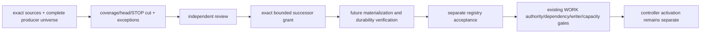

# R06 — trusted producer／current-registry bootstrap 提案

狀態：ARCHITECTURE_PROPOSAL / NOT_READY_FOR_BOOTSTRAP / NOT_AUTHORIZED。未建立 registry、receipt 或 current pointer；既有 WORK re-entry、intake、reading owner 與 accepted control 不變。

## 問題、來源與 scope

現有 CURRENT projection 明列空 execution／writer，但未提供完整 global pending registry。七類 UNKNOWN 不能因收到 heartbeat、目錄沒有檔案、已知002 accepted、完整 synthetic claims 或 tests PASS而改成 NONE。本提案將34份有界來源、6種 producer role候選、9類 coverage 與8項未來 exact grant bindings連結；producer roles不是已接受的producer identities。

Program V2 operational revision「5」由 exact accepted operational-baseline／acceptance解析；definition內歷史 authoring status保留。lane003–009不是 DAG dependency order。P00 human authoring branch與 Program V2 execution registry分開；local P00 report／review packet不能被注入成 operational ACCEPTED或全域 current verdict。

既有002 result intake／writer release／verdict／acceptance提供正向已接受 predecessor 證據，不能證明其他 pending分類為空；不重開002、不重用 consumed／retired identities、不補造 invocation。source refs保存 raw Git blob／SHA256與完整baseline SHA，包含全部七份manifest active policies；hash核對不是semantic qualification。

## Producer ownership 與完整性

| Role候選 | 分類 | 必要正向來源 | 禁止推論 |
|---|---|---|---|
| WORK_CONTROL | stop, active_execution, active_writer | CURRENT_CODEX explicit projection + authoritative lifecycle/writer ledger heads | NONE is bound source projection only; process/global absence not attested |
| EXECUTOR_RESULT | pending_result | Exact invoked execution lineage, immutable raw result revision/head and intake disposition | Executor append is not global registry writer, result acceptance or writer release |
| INDEPENDENT_REVIEWER | pending_review | Exact review request/subject/scope, independent identity and verdict/head | PASS is not integration/acceptance; author packets are not independent verdicts |
| WORK_INTEGRATOR | pending_integration | Exact reviewed source blobs/destination/revision and integration disposition/head | Merged files cannot change reviewed subject or imply P00/product acceptance |
| ACCEPTANCE_OWNER | pending_acceptance, last_accepted_result | Exact review/integration/test/delegation/acceptance lineage and immutable head | Accepted002 preserved; delegation cannot expand to003/P00/activation |
| WORK_DELTA | latest_delta | Bound program/package/execution delta identities, generation head and complete outstanding set | Timestamp/branch recency is not authoritative latest delta; missing pointer UNKNOWN |

所有 accepted producer identity／capability／head 目前 UNBOUND。reader receipt producer亦 UNQUALIFIED。完整 producer universe 須覆蓋 program/predecessor still-effective grants、所有啟動 execution與各類 raw producer heads；不是掃目錄後依檔名填表。忽略一個 producer／head、unobserved execution 或 STOP都使相關 coverage INCOMPLETE。

## 九類 coverage 與 UNKNOWN／NONE

| 分類 | 目前 bound projection | global coverage | 取得 NONE 的必要證據 |
|---|---|---|---|
| stop | UNKNOWN | INCOMPLETE → UNKNOWN | Accepted STOP producers, every scope and governing policy version; Complete producer heads/no unobserved events cut; Outstanding effective STOP set; clear/revoke evidence remains immutable |
| active_execution | NONE | INCOMPLETE → UNKNOWN | All started execution/grant dispositions across governing/predecessor programs; Invocation/first-invocation/resume lineage and unfinished states; Retired/closed/consumed identities retained without reusing them |
| active_writer | NONE | INCOMPLETE → UNKNOWN | Unique accepted writer ownership and durable release disposition; Writer registry head reconciled with all started executions; No OS/process absence inference from source null |
| pending_result | UNKNOWN | INCOMPLETE → UNKNOWN | Every invoked producer/result revision and raw payload hash; Intake receipt/head and rejected/conflicting/raw-unintaken results; Writer release separately bound; cannot release from result existence |
| pending_review | UNKNOWN | INCOMPLETE → UNKNOWN | All requested/assigned/open/re-review identities and exact subjects; Independent reviewer producer identity/head and verdict dispositions; P00 prepared packets in separate human-authoring namespace, not ProgramV2 current verdicts |
| pending_integration | UNKNOWN | INCOMPLETE → UNKNOWN | Every reviewed candidate requiring integration and destination proof; Reviewed exact blobs, source subject, destination head and integration outcome; Same reviewed scope, no silent semantic source change |
| pending_acceptance | UNKNOWN | INCOMPLETE → UNKNOWN | All reviewed/integrated packages awaiting exact delegated acceptance; Explicit accept/reject/hold decision lineage and test source; Review/integration accepted only in their own scopes; no blanket new grant |
| latest_delta | UNKNOWN | INCOMPLETE → UNKNOWN | All active work lineage delta producer heads; Per-consumer exact unread source set and successor invalidation; No timestamp-derived latest; known accepted baseline is not exhaustive delta |
| last_accepted_result | UNKNOWN | INCOMPLETE → UNKNOWN | All applicable accepted result heads by exact program/package revisions; Acceptance review/integration/test/source hash chain; Accepted002 is positive bounded evidence, not global absence/completeness |

表內 execution／writer 的 NONE只指已綁定 source projection，維持原 observation；不等於 global completeness或 OS/process attestation。global bootstrap knowledge仍UNKNOWN。只有 accepted bootstrap、exact program與完整producer universe/head cut、該分類 COMPLETE、正向空集合與一致性／integrity證據全部滿足時，才能由 qualified consumer投影NONE。

UNKNOWN阻擋依賴它的 autonomous eligibility，仍允許另有明確 human authority的 P00設計。已知 PRESENT項目必須處理，但同樣不取代其他producer完整性。STOP與pending categories不能被只看最新單一文件的摘要省略。

## Bootstrap 與 exact grant

B01 exact source re-entry → B02 bounded inventory及exceptions → B03 independent review → B04 exact operational successor grant → B05 future materialization → B06 registry acceptance → B07只讀orchestration及既有gate。所有 operational stages目前未執行；無自動 controller promotion。

未來 grant 必須綁定：exact reviewed proposal/source hashes、accepted producer identities/capabilities/universe、master/program/predecessor、initial snapshot coverage/exceptions、reader trust compatibility successor、明列write paths/backend/expected head、crash/CAS/STOP驗證與acceptance邊界，以及single writer／activation exclusions。未來 current pointer path仍UNDECIDED，故提案不是可執行 migration package；grant ID、allowlist及kernel不能由作者自行補成authority。

推薦沿用 Git control plane的 append-only successor，保留receipt、snapshot與guarded pointer的同一原子單位。Git commit shape不是durability/currentness/concurrency證明，backend contract及實際crash/CAS qualification仍待exact review。第二套DB backend屬另案，不由本提案授權。

## Head／STOP、CAS 與冪等

snapshot cut綁定 master、program definition/revision、registry revision/hash、完整producer-universe hash及各producer head、STOP head、contract revision、逐類coverage。timestamp僅audit，不取代causality。item identity使用program/package/work-order/execution/kind/result revision exact tuple；只在kind明示不適用時null，不把unknown或missing轉null，revision lexical/types沿用既有source。

選 action與開始 side effect前重驗head。head／STOP／governing source drift作廢舊proposal，重新讀取，不攜帶舊writer lease。既有未完成 execution／first-invocation／resume lineage規則不變。

Intake key沿用 `(program_id, producer_id, result_identity, result_revision)`。同key同payload回傳原receipt，異payload為CONFLICT；不是較新時間覆蓋。重試先以exact producer/key查原receipt及immutable accepted input，head已推進不重做CAS、不改原receipt；只有沒有receipt的新intake才驗fresh expected cut並CAS。重播不新增dispatch或release權限。receipt／snapshot／current pointer須一起提交；writer release仍需既有exact lifecycle authority，不能由result或receipt存在推導。實際two-writer與crash tests尚未執行。

## Reader trust 相容性 — RQ03-COMPAT-01

legacy acknowledgement key綁role/program/source item/blob；reading claim key包含task/session/epoch、plan與obligation。它們是不同artifact kinds，不能互相當成trusted receipt。保留legacy records，未來validity witness另外綁qualified producer與consumer、exact scope/source/plan/payload、完整obligation closure，以及governing registry/STOP/contract。

role-only舊ack不可跨task/session/epoch自動沿用；self-declared session ID不能成process attestation。consumer／producer trust未qualified時維持UNKNOWN及reread。read receipt即使未來qualified，也不表示review、result intake、acceptance或dispatch grant。本相容性設計仍待獨立review與explicit successor authority，未改任何舊key／schema／receipt。

## 替代方案、反例與限制

T01推薦：exact review／grant後建立既有Git owner successor。T02可作本機只讀interim inventory，持續UNKNOWN，不生成trusted head／eligibility。T03新DB backend延後另案。這些是候選建議，不代表已啟用選項。

同名JSON列BT01–BT12：producer/head遺漏、STOP race、concurrent same-key、payload conflict、crash、舊subject PASS、writer未release、consumed無invocation、legacy ack失效、accepted002被誤當global empty、schema／模型trust缺口與test/review錯當activation。**全部actual backend tests NOT_RUN**；已有40項offline reading spec observations不補足它們。

本輪只驗source pins、identity／coverage表完整性、null/false授權邊界與既有platform conformance；不宣稱trusted registry／reading qualification。原aggregate128KiB、source01 mandatory negative binding migration、source02 CSV A/B決策、independent P00 acceptance與exact product grant均未通過。十三個active denials、七個invariants及full-source fallback保留。

References：同名machine proposal內22份authoritative master sources與12份candidate design refs；`CURRENT_INTAKE_REGISTRY_CONTRACT.md`、`CONTEXT_READING_RECEIPTS.md`及latest23-artifact reading-spec checkpoint。來源盤點有界，outside-universe與global producer completeness未斷言。
